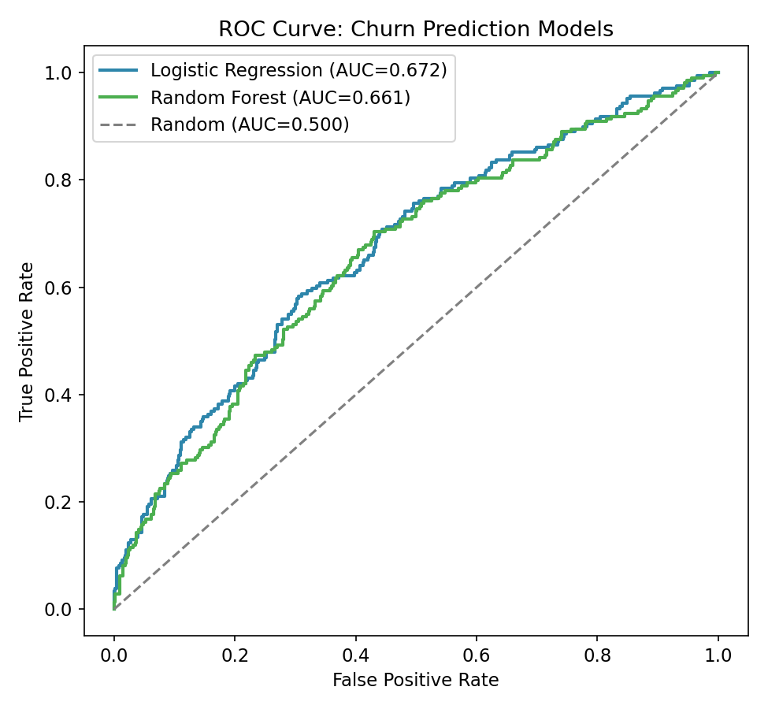
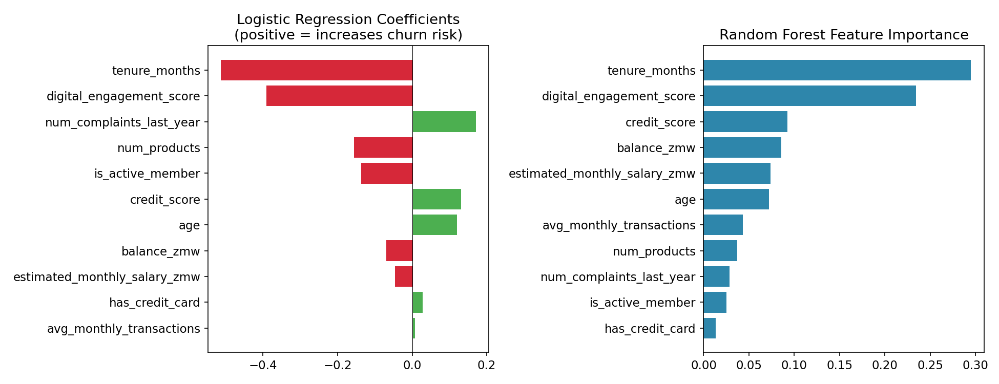
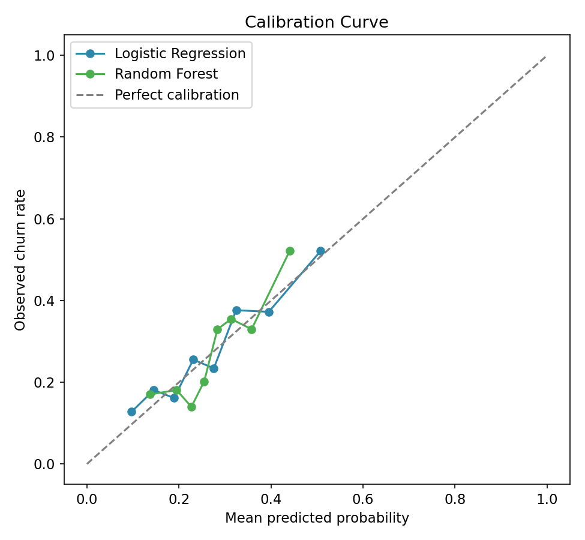
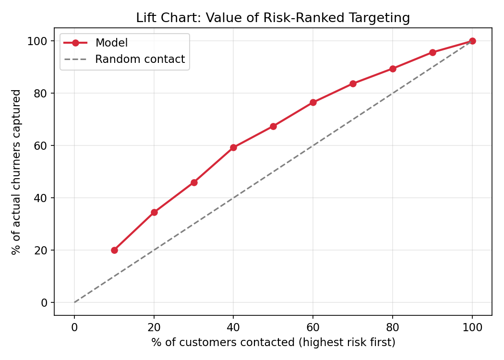

# Customer Churn / Propensity Model — Findings

## Data note

Real customer/account data is confidential, so this project runs on a
synthetic dataset of 3,000 bank customers. Critically, the data-generating
process (`python/generate_data.py`) includes **substantial irreducible
noise** deliberately — this is not a synthetic problem engineered to be
easy. Several features (credit score, has-credit-card, average monthly
transactions, estimated salary) were included as candidate predictors but
were **not** part of the true churn-generating process at all, specifically
to test whether the model would correctly learn to down-weight them.

## Finding 1: honest model performance — AUC ~0.67, not an inflated number

| Model | Test AUC | 5-fold CV AUC |
|---|---|---|
| Logistic Regression | 0.672 | 0.680 ± 0.015 |
| Random Forest | 0.661 | 0.672 ± 0.005 |

An AUC of 0.67 is a real, useful, but modest result — clearly better than
random (0.50) but far from a "solved" prediction problem. This is the
honest ceiling given the noise level built into the data-generating
process, and it's reported as such rather than tuned or cherry-picked to
look stronger. Cross-validation confirms both models' test-set AUCs
weren't a lucky single split.

## Finding 2: the simpler model won — worth reporting, not burying

**Logistic Regression slightly outperformed Random Forest** on both test
AUC and cross-validated AUC, despite Random Forest being the more
flexible model. This is a genuinely useful finding, not a disappointing
one: it suggests the true relationship between these features and churn
is close to linear/additive (consistent with how the synthetic data was
actually generated), and a more complex model doesn't help — and may
mildly overfit — when that's the case. In a real deployment, this result
would argue for shipping the simpler, more interpretable model rather than
defaulting to "more complex must be better."

## Finding 3: the model correctly learned to down-weight features that weren't real signal

Standardized logistic regression coefficients, ranked by magnitude:

| Feature | Coefficient | In true generating process? |
|---|---|---|
| tenure_months | −0.513 | Yes |
| digital_engagement_score | −0.391 | Yes |
| num_complaints_last_year | +0.171 | Yes |
| num_products (single-product flag) | −0.156 | Yes |
| is_active_member | −0.137 | Yes |
| credit_score | +0.131 | **No** (pure noise feature) |
| age | +0.121 | Yes (small true effect) |
| balance_zmw | −0.070 | Yes (small true effect) |
| estimated_monthly_salary_zmw | −0.045 | **No** (pure noise feature) |
| has_credit_card | +0.029 | **No** (pure noise feature) |
| avg_monthly_transactions | +0.008 | **No** (pure noise feature) |

The five real predictors with meaningful true effects occupy 5 of the top
7 positions, and the four pure-noise features (credit_score,
estimated_salary, has_credit_card, avg_monthly_transactions) all landed in
the bottom half by magnitude — with one caveat worth stating plainly:
**credit_score's coefficient (0.131) is larger than two features that
were genuinely predictive (age, balance)**, despite having no true effect
at all. This is a realistic reminder that finite-sample noise can produce
a spurious coefficient of meaningful size even when the feature is
genuinely irrelevant — exactly why real deployments validate feature
importance against domain knowledge and, ideally, a second independent
sample, rather than trusting one model fit at face value.

## Finding 4: calibration is reasonable but not perfect — relevant if probabilities feed a financial decision

Brier scores: Logistic Regression 0.185, Random Forest 0.189 (lower is
better; a model predicting the base rate for everyone scores
0.278×(1−0.278) ≈ 0.201, so both models modestly beat that naive
baseline). The calibration curve shows both models are reasonably
well-calibrated in the low-to-mid probability range but noisier at the
high end, where fewer customers fall — worth flagging if predicted
probabilities were ever used directly in a financial calculation (e.g.,
expected loss = probability × exposure) rather than only for ranking.

## Finding 5: the model is genuinely useful for targeting, even at AUC ~0.67

Despite the modest AUC, **contacting the top 3 risk deciles (30% of the
customer base) captures 45.9% of actual churners** — nearly 1.5× better
than random targeting. This is the business-relevant translation of the
AUC number, and it's a substantial, real improvement in retention-team
efficiency even though the underlying discrimination is far from perfect.

## Business framing: confusion matrix at a chosen threshold

At a decision threshold of 0.35 (chosen to favor recall — in most
retention contexts, the cost of missing a genuine churner materially
exceeds the cost of a retention offer to someone who wouldn't have
churned anyway):

|  | Predicted: Stay | Predicted: Churn |
|---|---|---|
| **Actual: Stay** | 431 (TN) | 110 (FP) |
| **Actual: Churn** | 122 (FN) | 87 (TP) |

Precision 44.2%, recall 41.6% at this threshold. This is a genuine
trade-off worth stating plainly rather than picking a threshold that
looks best on paper: a lower threshold would catch more churners at the
cost of more false alarms (and retention-offer spend on customers who
wouldn't have left anyway) — the right operating point depends on the
actual cost of a retention offer vs. the value of a retained customer,
which would need real business inputs to set precisely in production.

## Relevance to credit scoring and propensity modelling generally

This pipeline — feature engineering, train/test split with stratification,
an interpretable scorecard-style model compared against a stronger
black-box alternative, ROC/PR/calibration evaluation, decile/lift
analysis, and a business-relevant threshold discussion — is the same
structure used for credit default scoring or any other binary propensity
model. Swapping the label from "churned" to "defaulted" or "responded to
offer" and adjusting the feature set is the only change needed to apply
this same method to those problems.
